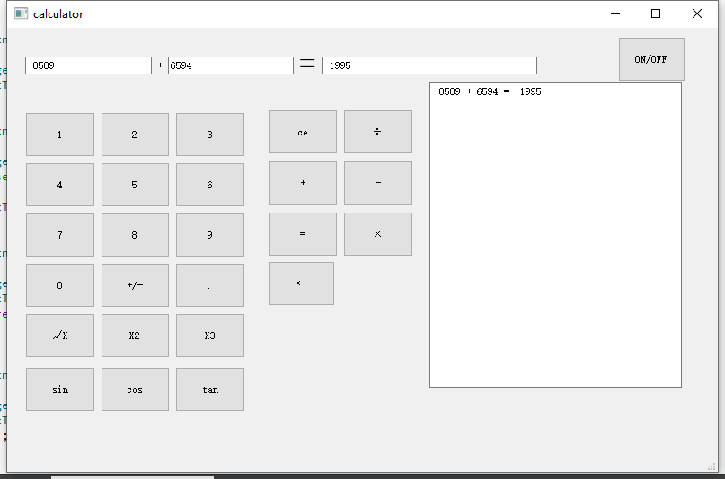

# Calculator

# description
一个由 qt5设计的简易计算器，仅仅是为了用来学习。
之后有时间重新更新输入输出和界面，使得更加人性化。

A simple calculator designed by qt5, just for learning.
Then there is time to update the input and output to make it more human.

# Platform
QT5.14

---
# GUI

原版GUI不再更新，文件在OLD_ONE中
原版图片：

